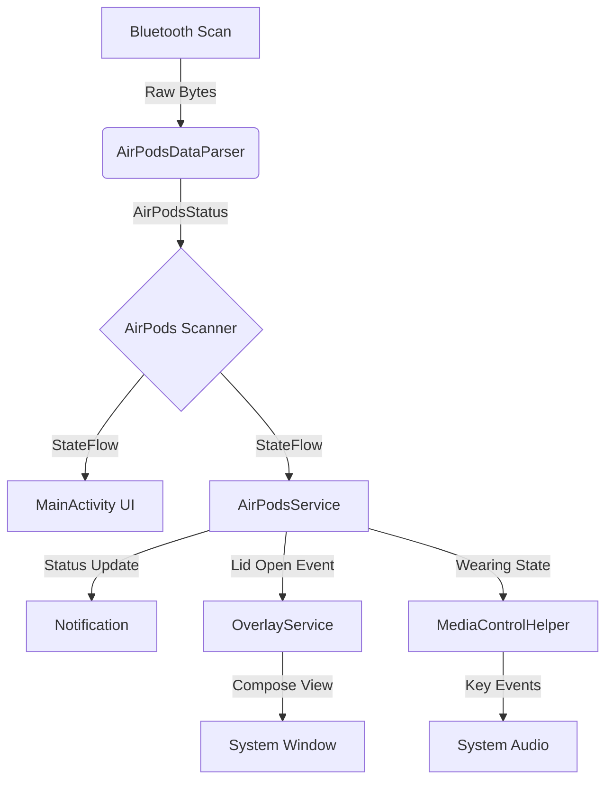

# Podify Architecture

Podify uses a lightweight, service-based architecture to minimize battery usage while ensuring reliable detection.

## Core Components

### 1. BLE Scanner (`AirPodsScanner.kt`)
- **Role**: Scans for BLE packets with filter `ManufacturerID=76` and `Data[0]=0x07`.
- **Strategy**: 
  - Low Latency Mode only when app is open or Bluetooth event occurs.
  - RSSI Filtering (> -60dB) to ignore distant devices.
  - Beacon Tracking to handle MAC address randomization.

### 2. Foreground Service (`AirPodsService.kt`)
- **Role**: Maintains the "Connection" state.
- **Responsibilities**:
  - Listens to Bluetooth On/Off events.
  - Manages the `AirPodsScanner` lifecycle.
  - Updates the Notification.
  - Triggers `OverlayService` on "Lid Open" events.
  - Invokes `MediaControlHelper` for auto play/pause.

### 3. Overlay System (`OverlayService.kt`)
- **Role**: Displays the popup.
- **Tech**: Jetpack Compose inside a `WindowManager` View.
- **Lifecycle**: Bound to `AirPodsService`, but manages its own View lifecycle.

### 4. UI Layer (`MainActivity` + Compose)
- **Role**: User interface.
- **Tech**: Material3, Jetpack Compose.
- **State**: reactive `StateFlow` from `AirPodsScanner`.

## Flow Diagram

